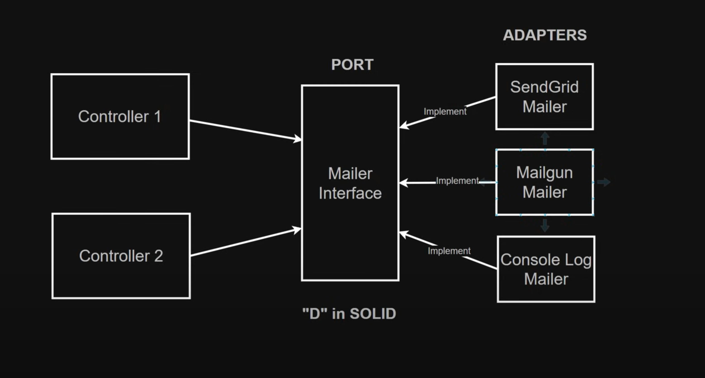

## В подключении сторонних сервисов используется паттерны Ports and adapters.

Что бы убрать жесткое связывание в коде, мы используем [порты и адаптеры](https://medium.com/wearewaes/ports-and-adapters-as-they-should-be-6aa5da8893b).
В роли портов выступает контракт или интерфейс Mailer строго определены бизнес-логикой без упоминания лежащей в их основе технологии.
`/src/lib/services/mailer`

```js
export interface Mailer {
  send: (notification: MailNotification) => Promise<void>;
}
```

в роли адаптеров `ConsoleLogMailer` и др., которые реализуют Mailer-интерфейс со своей внутренней логикой. Компоненты, которые позволяют приложению взаимодействовать с определенными технологиями.
`src/lib/services/mailer/console-log-mailer/ConsoleLogMailer.ts`

```js
export class ConsoleLogMailer implements Mailer {
  public async send(mailNotification: MailNotification): Promise<void> {
    console.info(mailNotification.text);
  }
}
```

Dependency injection pattern


